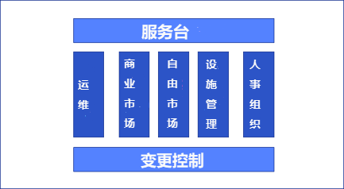
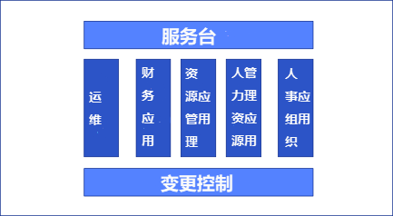

# 4 组织模式

## 4.1 介绍
本章描述了几种DevOps团队的组织模式。

## 4.2 术语
**服务台**
服务台是客户和服务供应商之间单一的接触点(SPOC)。二者之间主要的沟通内容包括问题，服务请求，事件，产品特性需求和投诉。服务台对于DevOps团队尤为重要，因为它使得DevOps团队可以专注于他们的流程。

**变更控制**
在每个DevOps团队内都存在通过一种关卡的形式来接受一个产品特性并推进它。这种控制被归纳为一个术语“变更控制”。它可以有多种体现形式，比如产品负责人，把关人，变更咨询委员会（CAB）。根据产品特性的风险和影响，同一个DevOps团队也可以选择不同的“变更控制”。

**垂直特性分割**
在理想的情况下，一个DevOps团队能够独立自主的实现一个产品特性。这意味着他们的工作不需要依赖于其他DevOps团队或者其他组织单位，如基础架构部门。这种方式的优点是，使得团队之间的沟通和协作最小化 。其缺点是，这个团队必须要有丰富的知识和专业技术。

**水平特性分割**
在一些服务组织中，需要一个专门的DevOps团队，他们只负责实现某个产品特性需求的一部分。在这种情况下，一个产品特性需求需要更多的DevOps团队一起协作才能最终发布这一产品特性。其优点是，这些团队对其负责的产品模块有丰富的知识并且能够交付高质量产品。其缺点是，几乎每个产品特性都需要两个以上团队协作才能在系统上线。

**模式**
一个模式是针对某个通用问题或反复出现问题的通用解决方案。一个DevOps团队可以通过分析他们遇到的问题以及解决问题的方法，从而总结出模式，并通过叙事分享给其他的DevOps团队。本章给出了一些关于如何组建DevOps团队的模式。

## 4.3  概念
**特性分割**
在DevOps团队中有两种方法来细分产品特性，即垂直特性分割和水平特性分割。垂直分割特性意味着一个DevOps团队要处理整个产品特性。水平分割意味着需要多个DevOps团队共同来实现一个产品特性。

一般来说，我们首选垂直分割，因为这只需要较少的团队间交互。然而，这并不是总能实现，比如应用程序与/或基础架构过于复杂。本章将会提及每个模式所使用的特性分割方法。

## 4.4 模式
在组建DevOps团队时已经识别出了多种模式。每种模式都有它的优点和缺点。本章主要讨论三种模式，被称为：
*  业务线模式。这种模式下DevOps团队只为一条业务线工作。
*  组合模式。这种模式基于应用程序组合中的各个应用来划分DevOps团队。
*  信息价值链模式。这个模式特别适用于信息提供商把[信息池][1]转译成报告。

这三种模式每一种都应用了服务台和变更控制的各种职能。但每种模式对垂直分割和水平分割的使用方法是不同的。采用不同模式对DevOps团队的绩效及其工作质量都会产生很大影响。

### 4.4.1 业务线模式
业务线模式是按照应用程序来划分DevOps团队，而所有的应用程序又是根据不同的业务线来分割。在各个DevOps团队中的交互为零。因此这是一种垂直特性分割。

图4‑1, 业务线模式

在这种模式下，服务台是顾客和服务供应商之间的单一接触点。运维团队负责监控服务。变更控制是一个控制单元，在不同的DevOps团队间规划业务特性请求及系统上线。然而，这个变更控制是轻量级的，因为不同DevOps团队之间负责的产品特性很少被共享。

这些业务线是：
*  瞄准企业的商业市场；
*  瞄准自然人的自由市场;
*  在设备，停车场，餐馆及其他服务领域中提供服务的设备公司。

### 4.4.2 组合模式
最后一种常用的模式是投资组合导向模式。在这种组织形式中，团队是按照应用程序的功能而聚集。同样，这种模式也是基于垂直特性分割。

图4‑2, 组合模式

这些通用的DevOp团队（服务台，运维，变更控制）与业务线模式相同。应用程序集群的例子是财务应用服务，资源管理应用，人力资源应用和人事&组织应用。

### 4.4.3 信息价值链模式  
信息价值链模式试图通过一组相互协作的团队来提供信息，从而提供一个顾客信息服务。这就意味着DevOps报告团队想要设计一个新报告，需要至少一个最多五个DevOps团队的参与。因此，这是一个水平特性分割（参见特性分割章节）。

图4‑3, 信息价值链模式

在这个模式中，服务台是顾客和服务供应商之间的单一接触点。运维团队负责监控信息服务。基础数据团队负责收集信息文件。核算团队负责管理信息文件的处理流程及质量审计。运算团队负责执行报告中需要的数据计算。报告团队负责将计算好的数据提供给客户，报告形式包括数据市场，报告模版及应急报告。变更控制是一个控制单元，在不同的DevOps团队间规划业务特性请求及系统上线。

选择这种模式的原因是，像创建报告这种情况下，所需要用到的知识和专门技术太广泛。也可以改变这种模式，根据报告内容来为DevOps团队分组。然而，这就需要DevOps团队必须能够完成数据收集，数据核算，数据计算和数据报告的全部任务。因此，当各个团队工作于相同的应用程序和信息对象时，团队之间就会相互影响。

## 4.5 常见问题（FAQ）

| **#** | **分类** | **问题**                              | **答案**                                                 |
| ----- | ---------------- | ------------------------------------------ | ------------------------------------------------------------ |
| 1     | 选择             | 有更多的模式么？                       | 肯定会有更多的模式。一旦他们被识别，将会被添加到本章节中 |
| 2     | 延迟             | 一个外部变更控制会使DevOps团队速度变慢么？ | 的确。无论什么情况下，如果可能，都应该在及其需要时才引入控制。 |
表4‑1, FAQ – 组织模式

[1]: 原著用了information lake
